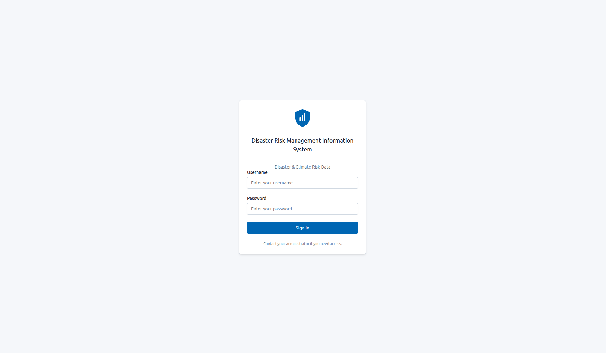
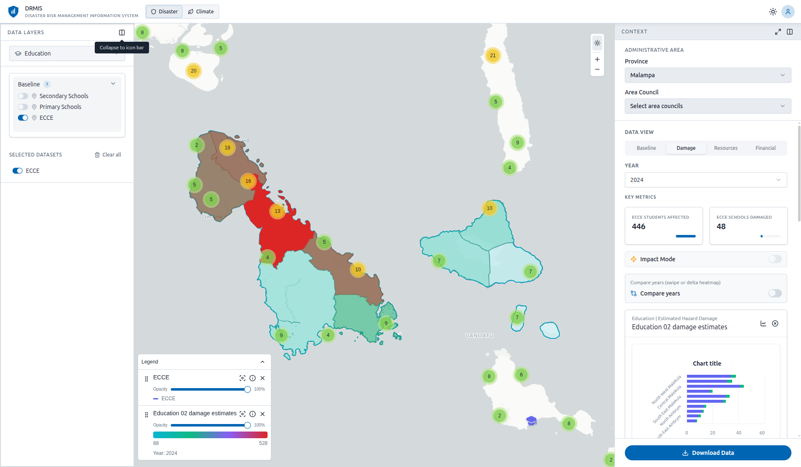
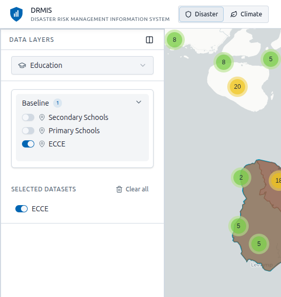
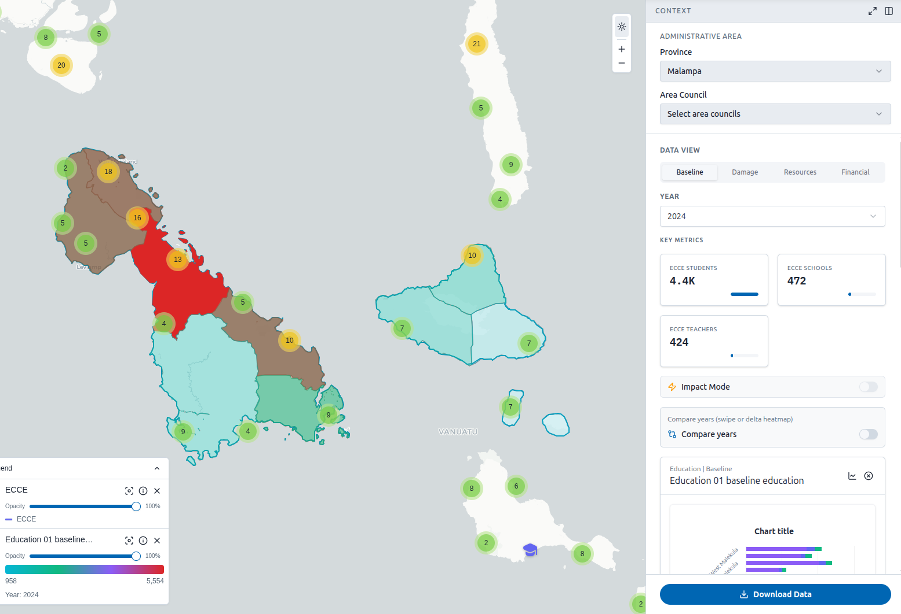
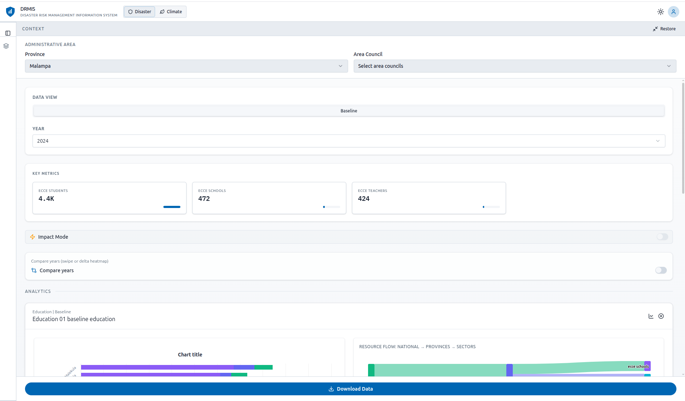
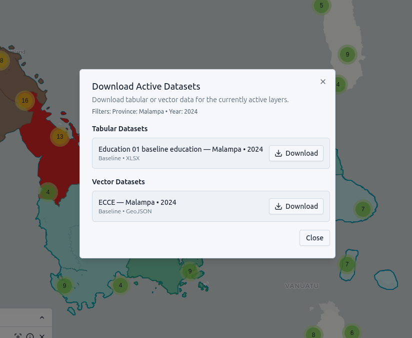

## Introduction

This user manual guides you through the **DRMIS** (Disaster Risk Management Information System) web application. You will learn how to sign in, use the Command Centre, explore map data, run simulations, review audit logs, export datasets, and manage your account.

## 1. Signing In

To access DRMIS, you must sign in with credentials provided by your administrator.

1. Open the application in your web browser.
2. You will see the **Sign in** screen with the DRMIS logo and title.

{fig-align="center"}

3. Enter your **Username** in the first field.
4. Enter your **Password** in the second field.
5. Click **Sign in**.

If your credentials are correct, you will be taken to the main dashboard. If you see an error, contact your administrator for access.

::: {.callout-tip}
## Contact Your Administrator

If you need access or have forgotten your password, contact your system administrator. DRMIS does not provide a self-service password reset.
:::

## 2. Main Dashboard

After signing in, you land in the **Command Centre**:

- **Top bar:** System status, live alert counter, color mode toggle, account menu.
- **KPI cards:** Pending submissions, live alerts, field teams deployed, and daily updates.
- **Recent submissions table:** Latest data submissions and quick edit links.
- **Live alerts and risk panels:** Operational awareness widgets.

{fig-align="center"}

### View Modes

- **Disaster:** Hazard and response datasets.
- **Climate:** Climate and land cover datasets.
- **Compare:** Side-by-side year comparison on the map.

Switch between modes using the tabs in the header.

## 3. Command Centre Operations

### Live alerts and notifications

- DRMIS merges **USGS, VMGD, GDACS, and internal DRMIS alerts**.
- When new critical/high alerts arrive:
  - the top alert badge pulses,
  - browser notifications can appear (if allowed),
  - a short alert tone is played.

### Creating a new incident

Use **+ New Incident** in Command Centre:

1. Select incident **type** and **severity**.
2. Select **province** and optional **area council**.
3. Enter title + summary, optionally attach a photo, then **Publish incident**.

Published incidents are saved to DRMIS alerts and appear in the live alert feed.

## 4. Enabling Data Layers

The left sidebar shows available **Data Layers** grouped by cluster (e.g., Education, Health, Infrastructure).

1. **Select a cluster** from the dropdown at the top.
2. Browse the list of datasets in that cluster.
3. **Enable a layer** by clicking on it or its checkbox. The layer will appear on the map.
4. You can enable multiple layers at once.

{fig-align="center"}

## 5. Filtering by Area and Year

The right sidebar lets you filter data by location and time.

### Administrative Area

- **Province:** Select one or more provinces using the checkboxes in the dropdown.
- **Area Council:** After selecting a province, you can optionally select one or more area councils.

{fig-align="center"}

### Data View and Year

- **Data View:** choose one of:
  - Baseline
  - Damage
  - Resources
  - Financial
- **Year:** select the year for tabular analysis (Disaster mode).

### Attribute Filter

- If you have a tabular layer active, you can filter by **attribute** (e.g., education type, population).

### Expand to Full Width

The right panel can be expanded to full width for a larger view of charts and statistics:

1. In the right sidebar header, click the **Expand to full width** button (expand icon).
2. The panel will overlay the map, giving you more space for filters, charts, and KPIs.
3. Click **Restore panel width** to return to the normal sidebar layout.

{fig-align="center"}

This is useful when you want to focus on data analysis without the map, or when viewing multiple charts side by side.

## 6. Compare Mode (Side-by-Side Years)

In **Compare** mode, map years can be adjusted directly on the map overlay:

- Use `-` / `+` controls near the year labels to change left and right years.
- Drag the center handle to compare areas visually.
- Use context filters to refine province and dataset view.

## 7. Simulation Wizard (Map)

Click **Simulate** (top-right of map) to open the simulation panel.

You can configure:

- Hazard intensity parameters (cyclone, flood, earthquake, etc.),
- Scenario assumptions,
- Estimated impact indicators.

Use **Run Simulation** to update outputs and **Reset** to return defaults.

## 8. Exporting Data (Exports Page)

Use the **Exports** menu in the left navigation for full export workflows.

1. Select a cluster.
2. Select datasets and formats (XLSX, GeoJSON, GeoTIFF, VRT, PMTiles).
3. Click **Export**.
4. Monitor status in-row and in the export queue:
   - loading spinner while downloading,
   - success/failure indicators,
   - toast messages for start/success/error.

## 9. Downloading Data from Context Panel

You can download tabular (XLSX) or vector (GeoJSON) data for the layers you have enabled.

1. **Enable at least one layer** from the left sidebar.
2. **Apply filters** (province, area council, year) if desired.
3. Click **Download Data** at the bottom of the right sidebar.
4. The **Download Active Datasets** dialog opens.

{fig-align="center" width="500px"}

5. The dialog shows:
   - **Active filters** (Province, Area, Year).
   - **Tabular Datasets** — XLSX format.
   - **Vector Datasets** — GeoJSON format.
   - **Raster Datasets** — VRT or GeoTIFF links (if applicable).

6. Click **Download** next to the dataset you want. The file will download to your browser’s default download folder.

::: {.callout-note}
## Filtered Downloads

Downloads respect your current filters. If you select Province: Shefa and Year: 2024, the downloaded file will only include data for Shefa in 2024.
:::

## 10. Audit Log

Open **Audit Log** from the left navigation:

- Filter by action, date, and search terms.
- Adjust page size (25/50/100).
- Use **Export CSV** for compliance and handover reporting.

## 11. Roles and Access

DRMIS uses role-based UI visibility:

- **Admin:** full access to all sections.
- **Analyst:** all operational sections except Settings.
- **Field officer:** Dashboard + Live Map + Data Entry.
- **Read-only:** read-focused sections (no admin-only controls).

If you try to open a restricted section, DRMIS shows a **You don't have permission** message.

## 12. Quick Reference

| Action | What to do |
|--------|------------|
| Sign in | Enter username and password, click Sign in |
| Switch view | Use Disaster / Climate / Compare tabs in header |
| Add data to map | Enable layers from left sidebar |
| Choose analysis lens | Select Data View: Baseline / Damage / Resources / Financial |
| Filter by area | Use Province and Area Council dropdowns (multi-select) |
| Filter by year | Use Year dropdown in right sidebar |
| Expand right panel | Click expand icon in right sidebar header for full-width view |
| Create incident | Command Centre → + New Incident (3-step wizard) |
| Export datasets | Left menu → Exports, then run export queue |
| Audit export | Left menu → Audit Log → Export CSV |

## 13. Signing Out

Sign out from the user menu in the header:

1. Click your **avatar** in the top-right topbar.
2. Select **Logout**.
